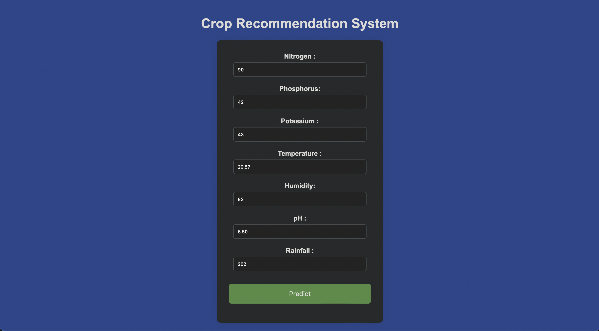

# Crop Recommendation Website

Deep Learning based crop-recommendation website based on weather, soil pH and soil chemicals content.

## Architecture Details
|**Architecture Type**|Linear|
|:---:|:----:|
|**Number of Input Features**|**7**|
|**Number of Layers**|**5**|
|**Optimizer**|**Adam**|
|**Loss Function**|**Cross Entropy Loss**|